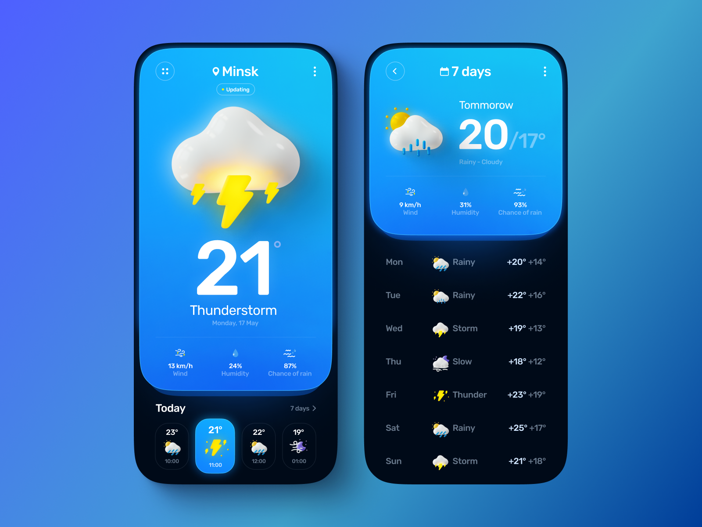

<h1 align="center">Hi! I'm <a href="https://cristianpenaportfolio.netlify.app/" target="_blank">Stalyin</a> 👋</h1>

  

<h2 align= "center">About me</h2>

  
    "Hello! I'm Stalyin, a passionate programmer and web developer. Currently, I'm immersed in the fascinating world of technology, exploring new tools and techniques to enhance my skills as a web developer. I love tackling creative challenges and finding innovative solutions to complex problems."
  

<h2>My Skills

    

</h2>

<h2 align= "center">Projects</h2>
<table>
<tr>
<td width="50%">
<h3 align="center">Doraemon Web</h3>

</td>
<td width="50%">

<h3 align="center">Weather app</h3>

                                       

 

                                                             
</table>                                                                                 

 

<h2 align= "center">⚙️ GitHub Analytics</h2>

